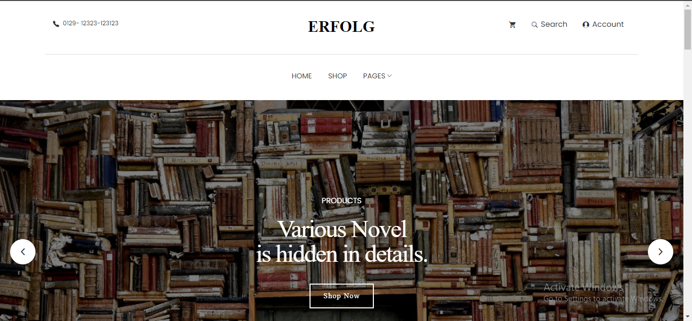
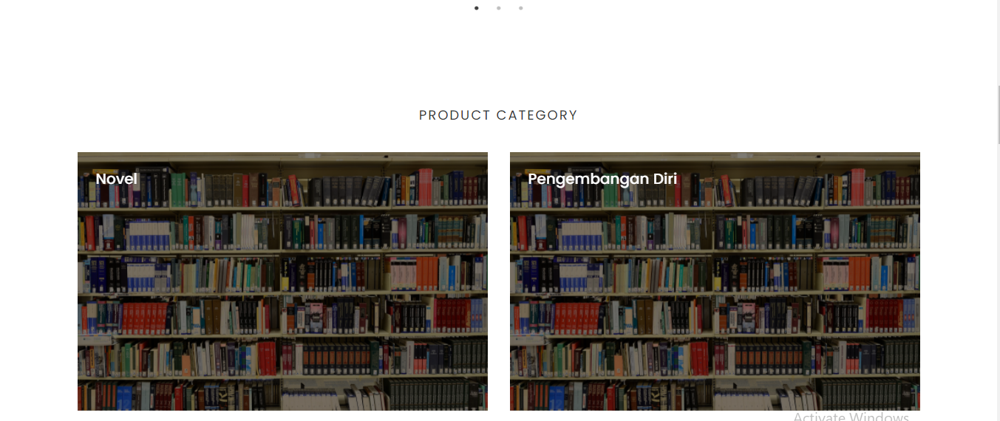
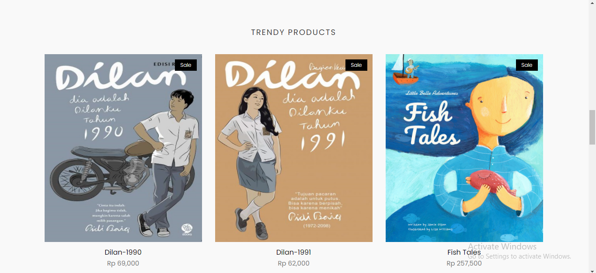
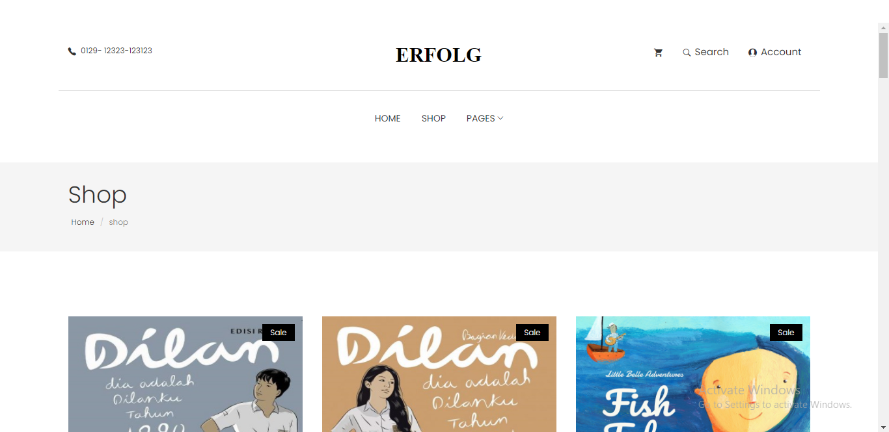
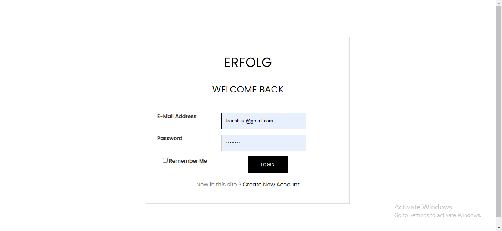
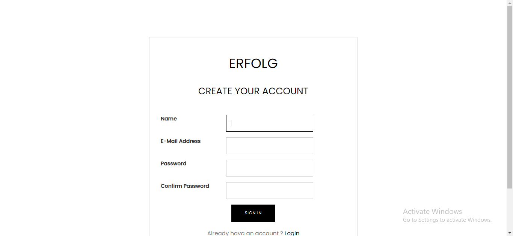
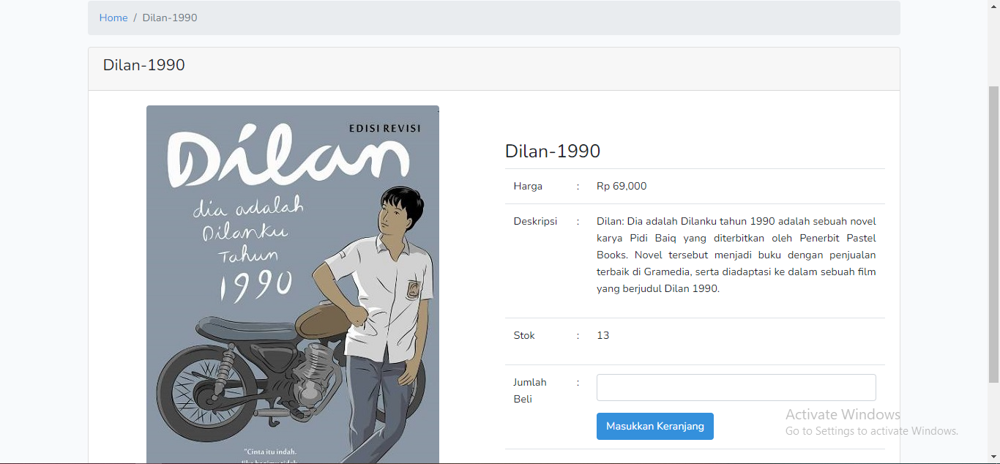
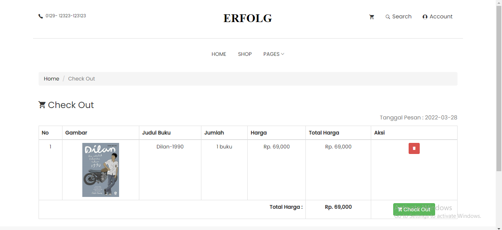

Website ini dikembangkan dengan html, css, bootstrap dan laravel. Sedangkan database menggunakan MySql. ini merupakan website toko buku yang menyediakan fitur-fitur sebagai berikut :
1. Home

    Halaman ini dapat diakses tanpa melakukan login, pelanggan dapat melihat koleksi buku yang ada pada toko buku ini.
    
    
    

2. Shop

    Untuk dapat mengakses halaman ini, pelanggan diharuskan untuk melakukan login atau sudah memiliki akun terlebih dahulu
    

3. Login

    Fitur ini memungkin pelanggan untuk dapat melakukan transaksi

    

4. Register

    Jika pelanggan belum memiliki akun, pelanggan dapat membuatnya terlebih dahulu melalui halaman register yang dapat diakses melalui "Create new account" pada halaman login, atau menuju icon profile di pojok kanan atas

    

5. Keranjang pesanan

    Pelanggan yang hendak membeli buku, dapat terlebih dahulu memasukkan pesanan ke daftar keranjang, selama persediaan buku masih ada

    

6. checkout

    Pelanggan yang sudah yakin dengan barang pesanan, dapat langsung melakukan checkout dan selanjutnya melakukan pembayaran
    
